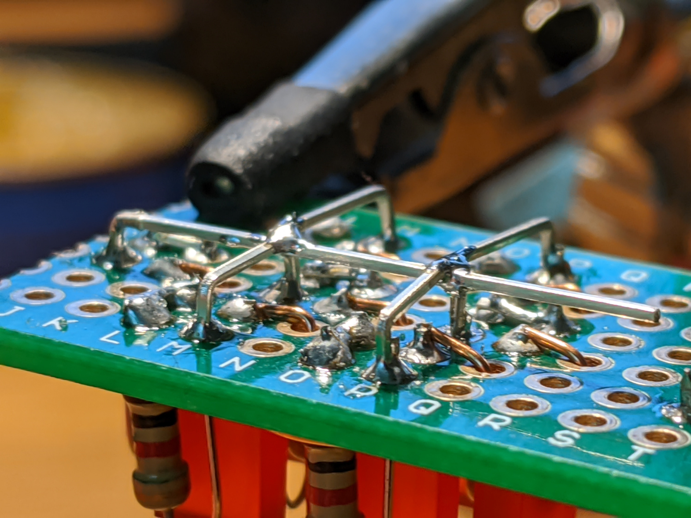
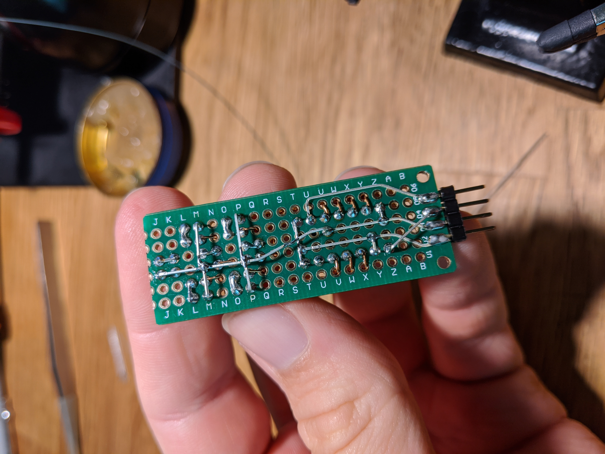
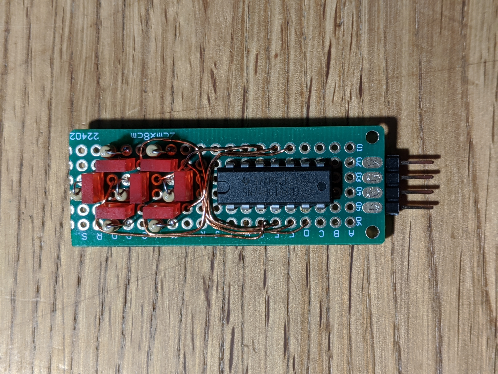
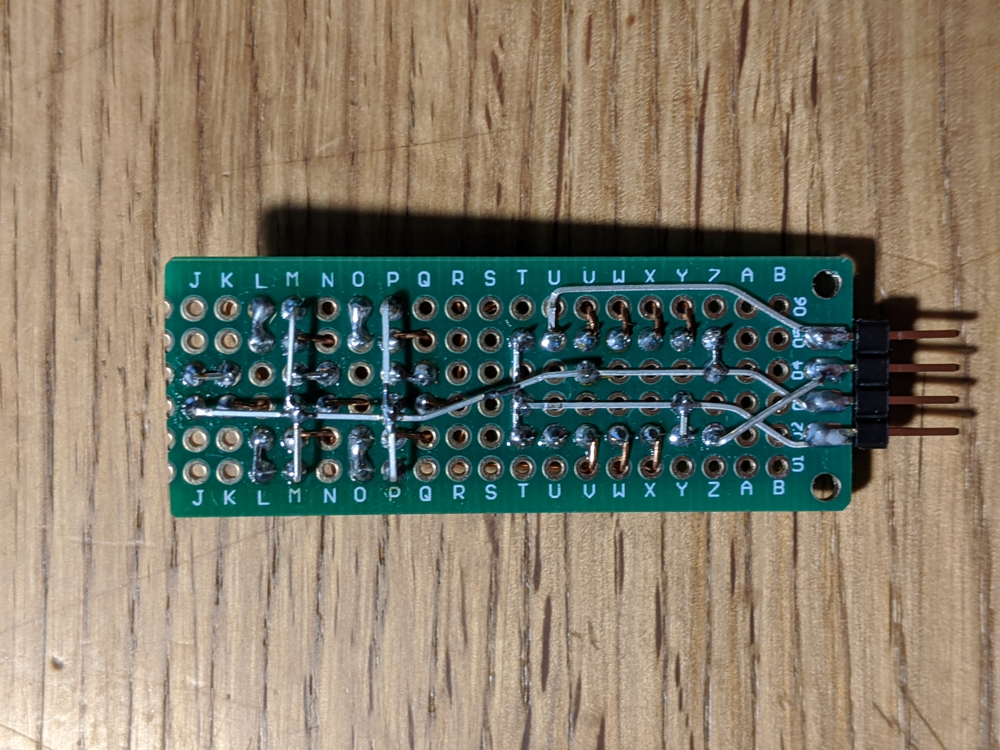
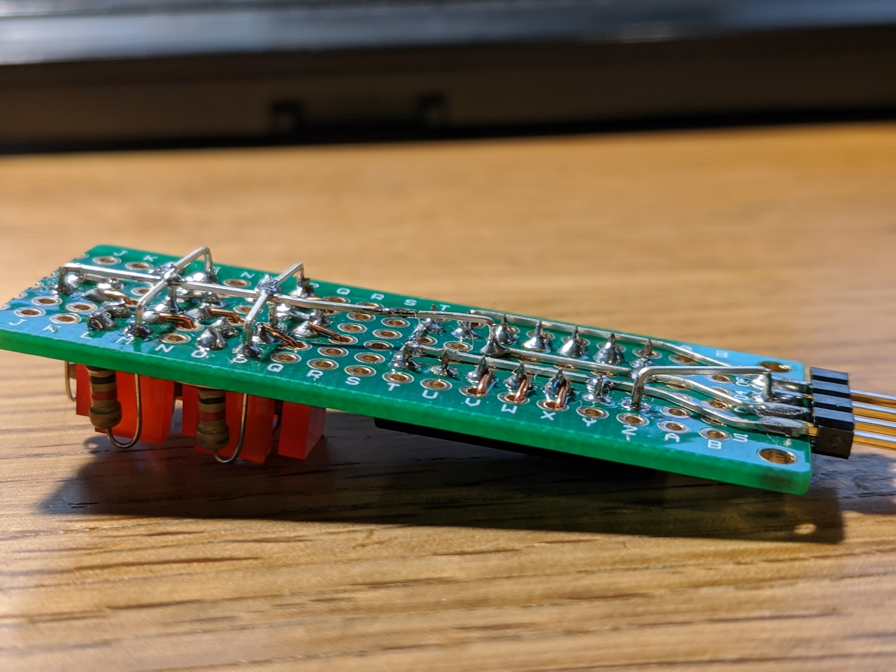
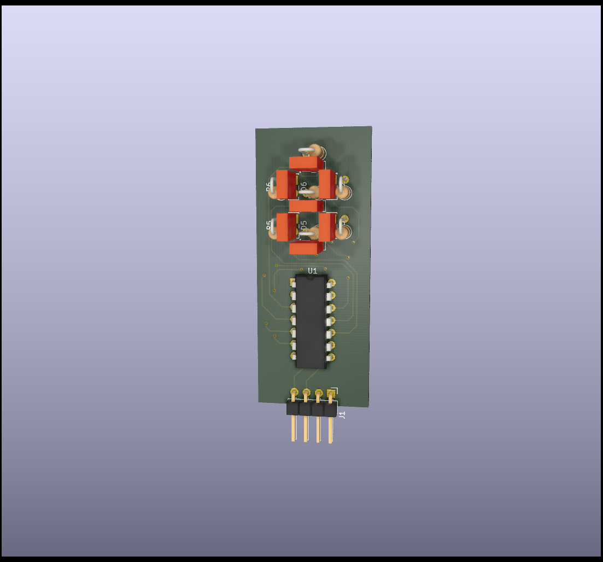

# O7STRTA

This is a silly seven-segment display that I soldered as a present for a friend.
It's just a shift register and a couple of LEDs.

Afterwards, I created a schematic in KiCad and mocked up a PCB to create a
rendering of what it looked like.

* [My notes and sketches](sketches.pdf)
* [Mock-up datasheet](O7STRTA%20Seven%20Segment.pdf)
* [Example script to interface with an FT232H](hello.py)

